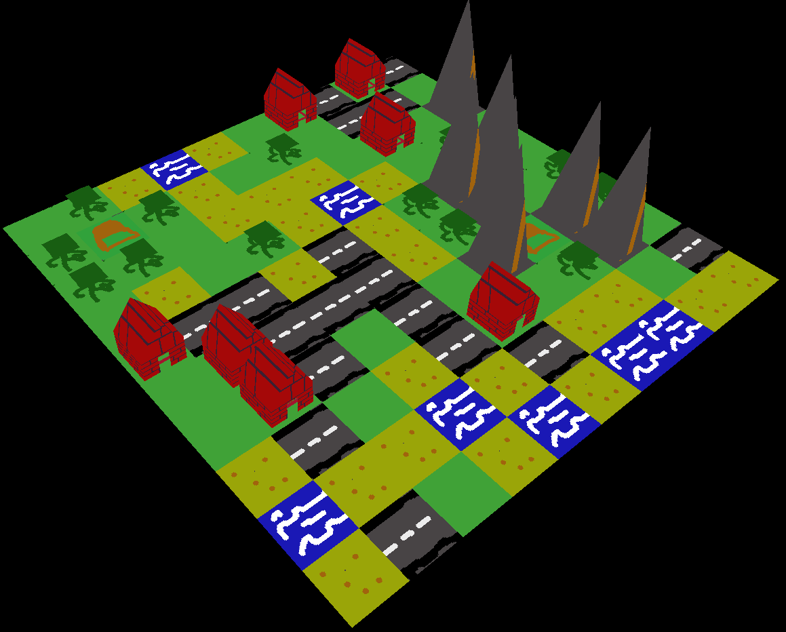

# Procedural

Procedurally generate and visualize tile maps given a set of tiles and a set of rules.



## Running the example
To change the size of the map, modify [/resources/size.txt](/resources/size.txt).

Run with `cargo run --example example` for simple run and `cargo run --example example --features view3d` for the 3d viewer

## Adding as dependency
Since this crate is not in crates.io, you'll have to add it to your Cargo.toml using a git path.
```toml
[dependencies]
procedural = { git = TODO}
```

# Tutorial
 1. Create an enum that will represent your tiles.
    ```rust
    enum MyTile {
        Grass,
        Sand,
        Water
    }
    ```
 2. Implement the `procedural::Tile` trait for your enum. See the [example](/examples/example.rs).
    ```rust
    impl Tile for ExampleTile {
        ...
    }
    ```
 3. Make sure that rules are bidirectional.

    Enable the feature "validate" and run your code to see which rules are not. Validation will happen in Board::new(). It is recommended to disable this feature when you make no changes to your Tile/Direction, since the results won't change and the performance of the validation is O(n²*m) where n is the amount of tiles and m the amount of directions.

    The code below is wrong:
    ```rust
    fn get_rules(&self) -> Box<dyn Fn(&MyTile, Direction) -> bool + '_> {
        match self {
            MyTile::Grass => Box::new(|tile: &MyTile, _direction: Direction| match tile {
                _ => true // According to grass, it can be placed next to water 
            }),
            MyTile::Sand => Box::new(|tile: &MyTile, _direction: Direction| match tile {
                MyTile::Grass => false,
                _ => true
            }),
            MyTile::Water => Box::new(|tile: &MyTile, _direction: Direction| match tile {
                MyTile::Grass => false, // According to water, grass can't be next to water.
                // Therefore the Grass <-> Water relationship is not bidirectional
                MyTile::Sand => true,
                MyTile::Water => true,
            })
        }
    }
    ```

 4. Generate a board
    ```rust
    use procedural::Board;

    let mut board = Board<MyTile>;
    board.generate();

    // If you have also implemented Display for MyTile you can also do this:
    println!("{}", board);
    ```
## Adding 3d models to your tiles
Models must have a 1.0x1.0 square footprint in order for them to be displayed properly.

 1. Enable the "view3d" feature in your Cargo.toml `procedural = { git = ..., features = ["view3d"] }`
 2. Two new methods of the `Tile` trait will have to be implemented: `get_name()` and `get_model()`. If get_model() returns None, the tile will simply be ignored when rendering.

The model is formed by 3 parts. The texture, the vertices and the indices.
 
Each tile (that has a model) **must** have a distinct name (unless 2 tiles share the same model), this name is also used to get the texture for the model. So if a tile's name is `"house"`, its texture will be at `resources/tiles/house.png`.

Vertices have 2 parts: the 3D position and the coords of the texture (from 0.0 to 1.0) at that point.

Indices represent which vertices form a triangle.

See [/examples/models/mod.rs](/examples/models/mod.rs) for manually made vertices and indices.

If your models are more complex than a single texture with a single mesh, you can leave `get_model()` and `get_name()` unimplemented and make your own `load_models()` instead of using `Board::load_models()`.

# Troubleshooting
* Something doesn't work/works wrongly

Make sure that after adding a new tile to the enum, it's added to the `Vec` returned by `Tile::all()`.

* generate() is in an infinite loop/too slow

If even small boards are slow/infinite to generate, check that no rules confilct and they are bidirectional, see [step 3 of the tutorial](#tutorial)

* 3D model doesn't render correctly

Tengine doesn't have lighting at all. It also culls triangles that are facing away from the camera. So if some (or all) triangles of the model are invisible, change the order of the indices.

* te_player::prepare() returns Error
Make sure you have an icon and InitialConfiguration.icon_path points to it. InitialConfiguration.font_dir_path must also be a valid path. See the [example](/examples/example.rs).
